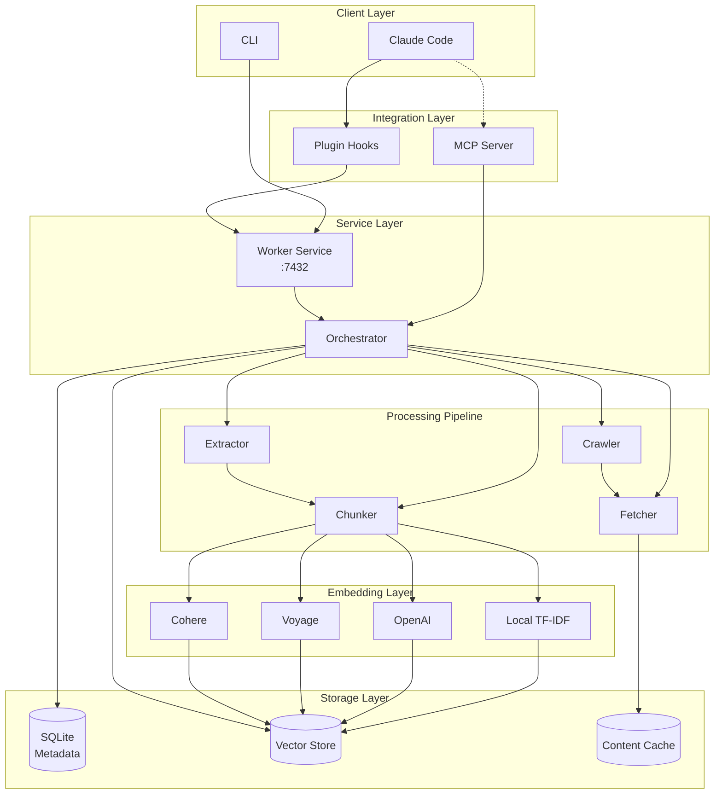
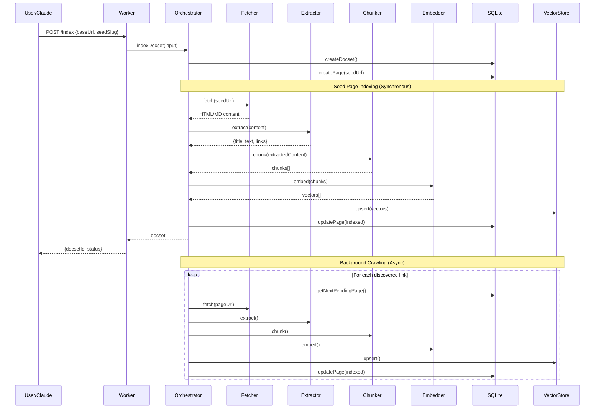
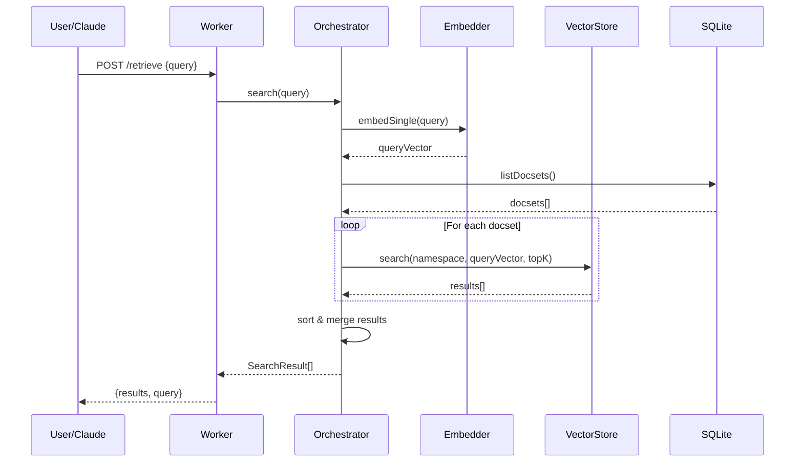
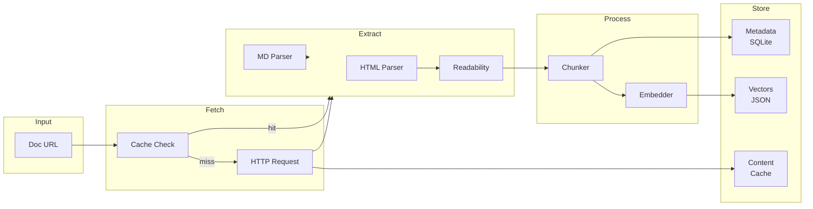

# mem-oracle

A locally-running documentation oracle that indexes web docs and injects relevant snippets into Claude Code context.

## Features

- **Seed-first indexing**: Index the seed page immediately, then continue background crawling
- **Local storage**: SQLite metadata + disk-based vector store (no external dependencies)
- **Pluggable embeddings**: Local TF-IDF fallback, or use OpenAI/Voyage/Cohere APIs
- **Claude Code plugin**: Hook scripts that auto-inject relevant docs into prompts
- **Optional MCP server**: Explicit tool calls for search/index operations

## Quick Start

```bash
# Install dependencies
bun install

# Start the worker service
bun run worker

# In another terminal, index some docs
bun run src/index.ts index https://nextjs.org/docs/getting-started

# Search indexed docs
bun run src/index.ts search "how to use server components"
```

## Usage

### CLI Commands

```bash
# Start the worker HTTP service (default: http://127.0.0.1:7432)
bun run src/index.ts worker

# Start the MCP server (stdio)
bun run src/index.ts mcp

# Index a documentation URL
bun run src/index.ts index <url>

# Search indexed documentation
bun run src/index.ts search <query>

# Show indexing status
bun run src/index.ts status
```

### Worker API

The worker service exposes these HTTP endpoints:

```
POST /index     - Index a documentation site
POST /retrieve  - Search for relevant snippets
GET  /status    - Get indexing status
DELETE /docset/:id - Delete a docset
GET  /health    - Health check
```

#### Index Request

```json
{
  "baseUrl": "https://nextjs.org",
  "seedSlug": "/docs/getting-started",
  "name": "Next.js Docs",
  "waitForSeed": true
}
```

#### Retrieve Request

```json
{
  "query": "how to use server components",
  "topK": 5
}
```

### MCP Tools

When running as an MCP server, these tools are available:

- `search_docs` - Search indexed documentation
- `get_snippets` - Get specific documentation chunks
- `index_docs` - Index a documentation website
- `index_status` - Get indexing status

## Configuration

Configuration is stored in `~/.mem-oracle/config.json`:

```json
{
  "dataDir": "~/.mem-oracle",
  "embedding": {
    "provider": "local",
    "model": "all-MiniLM-L6-v2",
    "batchSize": 32
  },
  "vectorStore": {
    "provider": "local"
  },
  "worker": {
    "port": 7432,
    "host": "127.0.0.1"
  },
  "crawler": {
    "concurrency": 3,
    "requestDelay": 500,
    "timeout": 30000,
    "maxPages": 1000
  }
}
```

### Using API Embeddings

To use OpenAI embeddings:

```json
{
  "embedding": {
    "provider": "openai",
    "model": "text-embedding-3-small",
    "apiKey": "sk-..."
  }
}
```

Or Voyage AI:

```json
{
  "embedding": {
    "provider": "voyage",
    "model": "voyage-2",
    "apiKey": "..."
  }
}
```

## Claude Code Integration

### Install as Plugin

```bash
# In Claude Code terminal
> /plugin add jagjeevanak/mem-oracle
> /plugin install mem-oracle
```

Then restart Claude Code. The plugin will automatically:
- Check if the worker service is running on session start
- Retrieve relevant docs when you submit prompts
- Auto-index documentation URLs detected in your prompts

### Manual Setup

1. Start the worker service:
```bash
bun run worker
```

2. The plugin hooks in `.claude-plugin/hooks/` handle lifecycle events

### As MCP Server

Add to your Claude Code MCP configuration:

```json
{
  "mcpServers": {
    "mem-oracle": {
      "command": "bun",
      "args": ["run", "/path/to/mem-oracle/src/index.ts", "mcp"]
    }
  }
}
```

## Architecture

### System Overview



### Indexing Flow



### Retrieval Flow



### Data Flow



## Development

```bash
# Run with hot reload
bun run dev

# Type check
bun run typecheck

# Run tests
bun test
```

## License

MIT
